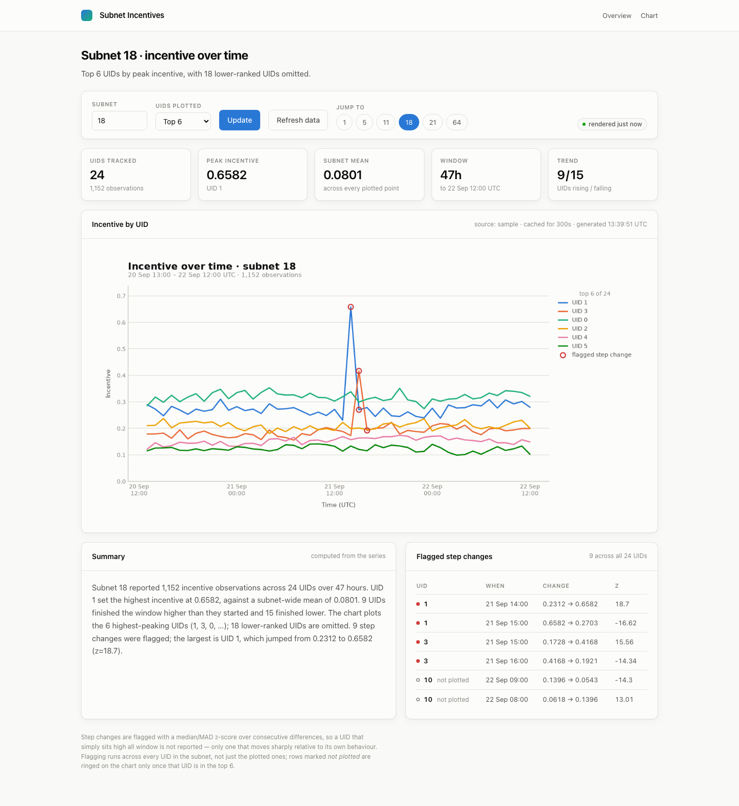
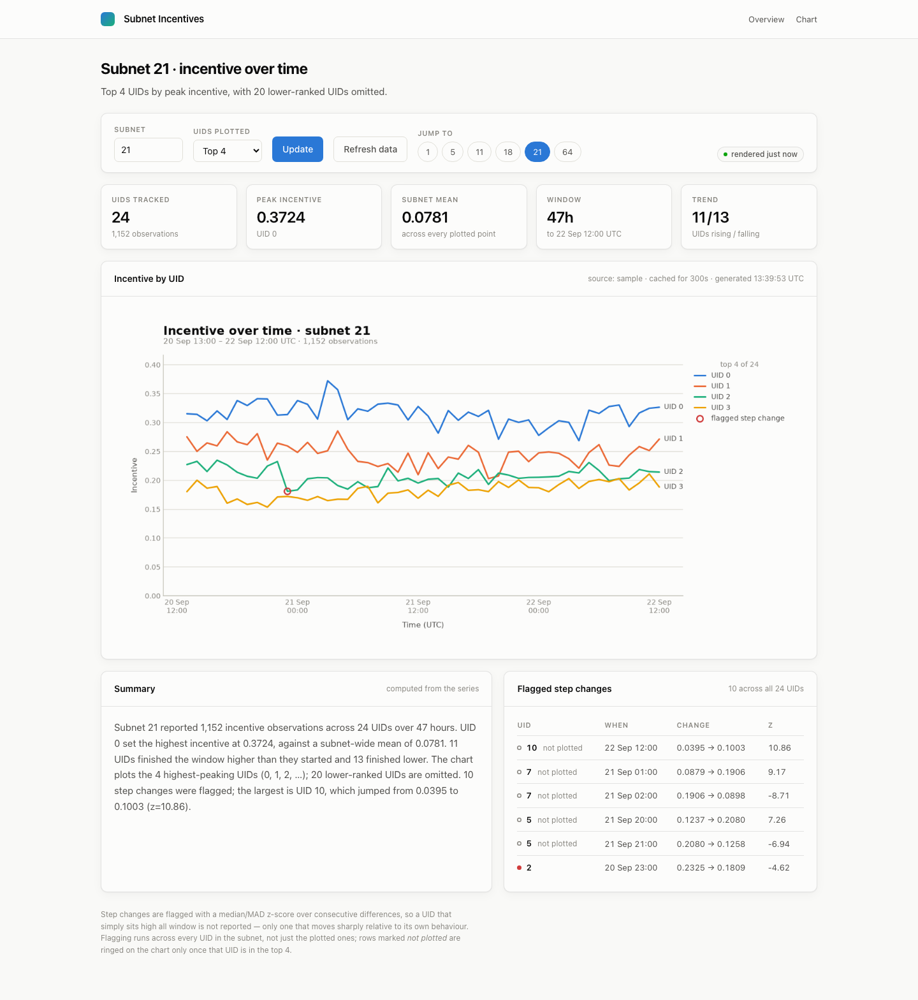
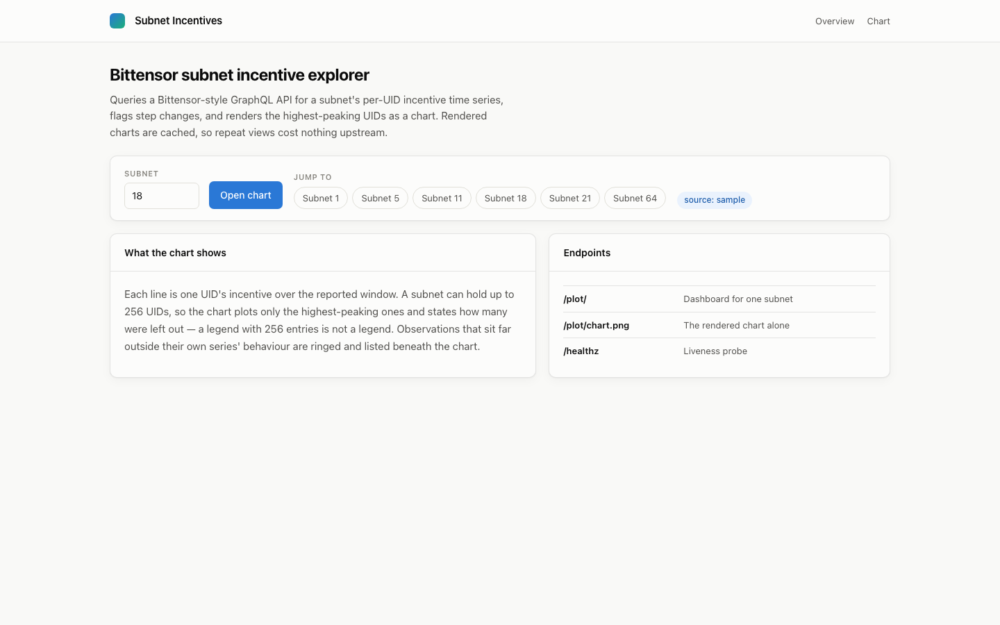
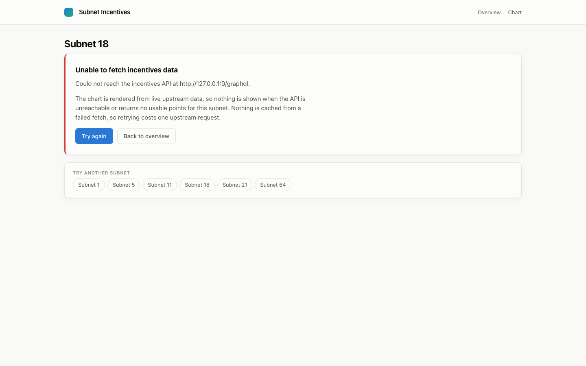
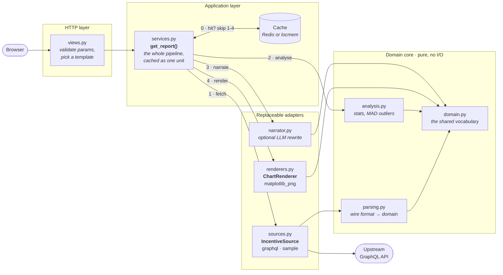
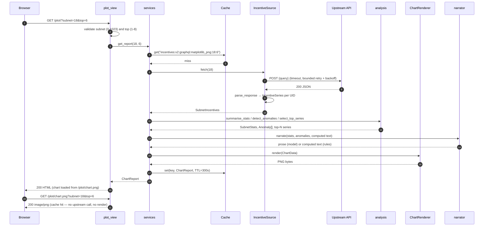

# graphql-incentives

A small Django app that queries a Bittensor-style GraphQL API for one subnet's
per-UID **incentive** time series, flags step changes in it, and renders the
highest-peaking UIDs as a chart.

It is a GraphQL **client**, not a server: there is no schema, no resolver, no
database and no user account anywhere in this repo. (The Django project package
is named `graphql` for historical reasons — it is unrelated to `graphene` or
`graphql-core`, neither of which is installed.)

---

## Screenshots

The subnet dashboard — stat tiles, the rendered chart, the written summary, and
the table of flagged step changes:



The same subnet narrowed to the top four UIDs. Under five series the renderer
adds direct end-of-line labels, because at that density they read better than a
legend:



The landing page:



The upstream being down is a normal condition, not a traceback. Nothing is
cached from a failed fetch, so "Try again" costs exactly one upstream request:



All four were captured with Playwright at 1440x900 against the app running on
the deterministic `sample` data source (`INCENTIVES_SOURCE=sample`), which is
why they are reproducible.

---

## Architecture

The app is a **layered pipeline with the dependency arrows pointing inward at
`domain`**. Nothing in `domain` imports Django, `requests` or matplotlib;
nothing in `views` fetches, parses, analyses or plots. The two outward-facing
layers — where the data comes from, and how the chart is drawn — are each
reached through a named registry rather than by direct import, which is what
makes them replaceable.



Reading the arrows: `services` is the only module that knows the whole story.
`parsing`, `analysis` and `domain` are pure functions of their arguments, which
is why roughly two thirds of the test suite lives against them and needs no
mocking at all.

---

## Request flow

A request for `/plot/` on a cold cache. The warm path stops at the first
`cache.get`.



---

## Quickstart

### Docker (one command, no manual steps)

```bash
docker compose up --build
# then open http://localhost:8240/plot/
```

Compose starts the app plus a Redis cache. `INCENTIVES_SOURCE` is set to
`sample` there, so the first boot is fully populated with deterministic data
and needs neither credentials nor network access — nothing to seed, no empty
state. Point it at the real API by setting `INCENTIVES_SOURCE=graphql` and
`GRAPHQL_API_URL`.

### Without Docker

```bash
python -m venv project_venv
source project_venv/bin/activate
pip install -r requirements.txt

INCENTIVES_SOURCE=sample python manage.py runserver 8240
# http://127.0.0.1:8240/
```

No `migrate` step: there is no database.

---

## Configuration

Every setting has a working default, so the app boots with no configuration.

| Variable | Required | Default | What it does |
| --- | --- | --- | --- |
| `DJANGO_SECRET_KEY` | in production | `dev-insecure-secret-key-change-me` | Django signing key. Set to a random value when deployed. |
| `DJANGO_DEBUG` | no | `False` | Tracebacks and unrestricted hosts. Defaults off — this project is deployed publicly. |
| `DJANGO_ALLOWED_HOSTS` | no | `127.0.0.1,localhost,.vercel.app,.now.sh` | Comma-separated host allowlist. |
| `INCENTIVES_SOURCE` | no | `graphql` | Which data source to use: `graphql` (live API) or `sample` (deterministic generator). An unknown name raises at request time rather than silently serving fake data. |
| `GRAPHQL_API_URL` | no | `https://api.taomarketcap.com/graphql` | Upstream endpoint for the `graphql` source. |
| `GRAPHQL_SUBNET_UID` | no | `18` | Subnet charted when the request has no `?subnet=`. |
| `GRAPHQL_REQUEST_TIMEOUT` | no | `10.0` | Seconds before an upstream call is abandoned. |
| `GRAPHQL_MAX_RETRIES` | no | `2` | Retries on connect/read errors and on 429/500/502/503/504. Other failures are not retried. |
| `GRAPHQL_RETRY_BACKOFF` | no | `0.5` | Exponential backoff factor between those retries. |
| `INCENTIVES_RENDERER` | no | `matplotlib_png` | Which registered renderer draws the chart. |
| `INCENTIVES_TOP_N` | no | `6` | UIDs plotted, ranked by peak. Capped at 8 — the palette has eight fixed slots. |
| `INCENTIVES_CACHE_TTL` | no | `300` | Seconds a rendered report stays cached, and the `max-age` sent with the PNG. |
| `REDIS_URL` | no | *(unset)* | When set, the cache is shared across workers and replicas. When unset, a per-process in-memory cache is used. |
| `ANTHROPIC_API_KEY` | no | *(unset)* | Enables the written chart summary. Without it the computed summary is used and nothing else changes. |
| `ANTHROPIC_MODEL` | no | `claude-opus-5` | Model used for that summary. |
| `AI_SUMMARY_ENABLED` | no | `True` | Kill switch for the summary, independent of the key. |
| `AI_SUMMARY_TIMEOUT` | no | `20.0` | Seconds before the summary call is abandoned and the computed text is used. |
| `LOG_LEVEL` | no | `INFO` | Root log level. |

---

## Development

```bash
source project_venv/bin/activate
pip install -r requirements-dev.txt     # includes requirements.txt + ruff

# run it
INCENTIVES_SOURCE=sample python manage.py runserver 8240

# tests — 135 of them, no network, no paid API call, no database
python manage.py test

# lint and format
ruff check .
ruff format .
```

The suite patches `requests.Session.post` and the Anthropic client everywhere;
no test performs network I/O or spends money. `requirements-dev.txt` pulls in
the runtime requirements, so one install covers both.

---

## Project structure

```
graphql/
  settings.py            env-driven configuration; no DATABASES, no migrations
  urls.py                includes incentives.urls at the root
incentives/
  domain.py              frozen dataclasses; the vocabulary every layer speaks
  parsing.py             GraphQL wire format -> domain. Pure.
  analysis.py            stats, median/MAD outliers, the computed narrative. Pure.
  sources.py             SEAM 1: IncentiveSource protocol + graphql / sample
  renderers.py           SEAM 2: ChartRenderer protocol + matplotlib PNG
  narrator.py            optional LLM rewrite of the computed narrative
  services.py            the pipeline and the cache. The only module that
                         knows the whole story.
  views.py               parameter validation and template choice. Nothing else.
  templates/             base, home, plot (the dashboard), error
  static/incentives/     one stylesheet
  tests/                 one module per source module
docs/screenshots/        the images above
Dockerfile               multi-stage, non-root runtime, healthcheck
docker-compose.yml       app + Redis on host port 8240
```

---

## Design notes

**Business logic left the view.** The original `plot_view` opened the HTTP
connection, walked the JSON, drove matplotlib and base64-encoded the result in
one function. It is now four modules with one direction of dependency, and the
view is thirty lines of parameter validation. That split is what made the rest
of this list testable rather than merely intended.

**Caching was the real bottleneck.** Every single request to `/plot/` performed
a live upstream fetch *and* a full matplotlib render inside the
request/response cycle — a few hundred milliseconds of CPU per hit, even when
the underlying data had not changed, which capped the app at a handful of
requests per second per worker. The whole `ChartReport` is now cached under a
key containing every input that changes the output (source, renderer, subnet,
top-N, cache version), for a TTL that is short relative to how fast incentive
data actually moves. On a hit, a request touches neither the network nor
matplotlib. With `REDIS_URL` set the cache is shared across workers; without
it, it is per-process — correct either way, just less effective.

**The chart moved to its own URL.** `/plot/chart.png` serves the image with a
matching `Cache-Control: max-age`, so browsers and any proxy in front of the
app cache the expensive artefact independently, the HTML document stays small,
and the page can show a skeleton while the chart loads. The base64 bytes are
still on the `ChartReport` for anything that wants the image inline.

**The upstream is treated as unreliable, because it is.** A pooled session
carries an explicit connect/read timeout and bounded retry-with-backoff, and
only retries the statuses worth retrying — a malformed query fails fast instead
of being hammered five times. A failed fetch is never cached and renders a 503
page, not a traceback.

**A legend of 256 entries is not a legend.** A subnet can hold up to 256 UIDs
and the old chart labelled every one of them. The chart now plots the top N by
peak, states the size of the remainder in the legend title ("top 6 of 24"), and
uses a fixed eight-slot categorical palette ordered so adjacent series stay
distinguishable under common colour-vision deficiencies. A ninth series is
never given a generated colour — it is folded into the omitted count instead.

**Two seams, both small, both load-bearing.** `IncentiveSource` is the one a
future developer actually hits first: a second vendor, a CSV export, or a
replay of captured fixtures is one class and one registry entry, and the
built-in `sample` source proves the seam works by being the thing that makes
Docker's first boot populated and the screenshots reproducible. `ChartRenderer`
is the second: an SVG or CSV output is one class, and the cache key already
includes the renderer name so the two cannot be confused.

**Outlier detection uses median/MAD, not mean/stdev.** A single large spike
inflates the standard deviation enough to hide itself. It runs over
*consecutive differences* rather than raw values, because a UID that sits
legitimately high all day is not an anomaly — a UID that doubles between two
samples is.

**The AI summary can only rephrase, never compute.** The model is handed the
statistics this app already calculated and asked to phrase them, so it cannot
invent a number the chart does not support. Every failure path — no key,
package absent, API error, empty response — falls back to the deterministic
paragraph from `analysis.describe`, and the page badges which one you are
reading. The app is fully functional with no key set.

**No database, deliberately.** `DATABASES` is empty rather than pointing at an
unused SQLite file, and `INSTALLED_APPS` carries only `humanize`,
`staticfiles` and this app. There is nothing to migrate and nothing to seed.

---

## Limitations

- **One upstream, one query shape.** The `graphql` source speaks to a single
  Bittensor-style endpoint and issues one hard-coded query document. It is not
  a general GraphQL client.
- **The window is whatever upstream returns.** There is no date-range picker
  and no pagination — the API decides how much history comes back.
- **Rendering is still synchronous.** A cache miss renders a PNG inside the
  request. That is a deliberate trade at this size: the TTL makes misses rare,
  and a queue plus a result store would be more moving parts than this app
  earns. At meaningfully higher traffic the right next step is pre-rendering
  popular subnets on a schedule, not adding a worker to the request path.
- **The cache has no warmer and no stampede protection.** N simultaneous
  requests arriving on a cold key will all render. At this scale that is a
  handful of wasted renders, not an outage.
- **Anomaly flagging is statistical, not causal.** It reports that a UID moved
  sharply. It does not know, and does not guess, why.
- **`sample` data is synthetic.** It is shaped like real subnet data — ranked
  plateaus, a long tail, occasional spikes, values inside [0, 1] — but it is
  generated, not recorded. The screenshots above use it.
- **No authentication and no rate limiting.** Anything reachable can request
  any subnet id in range.
